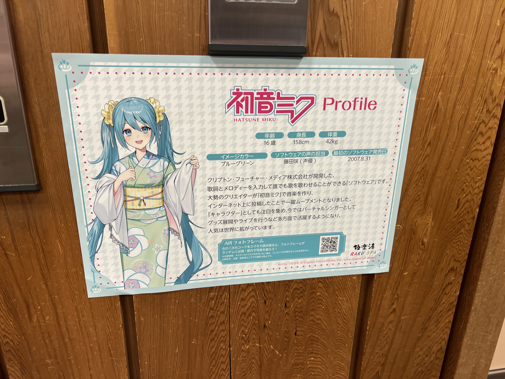
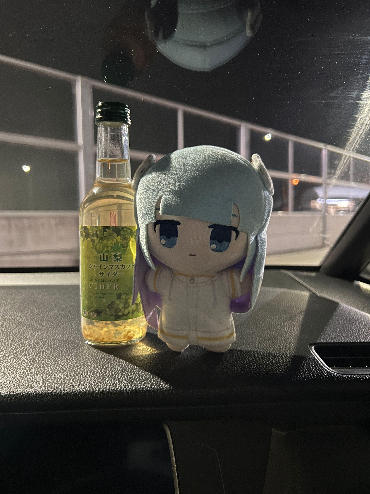
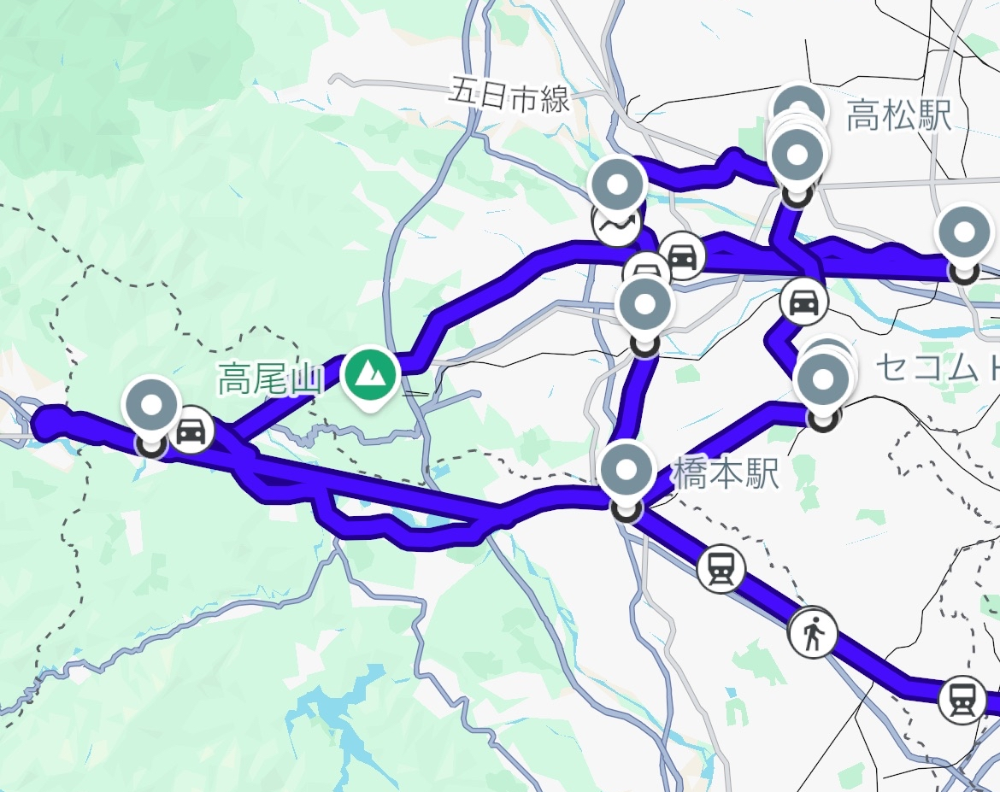

GW帰省してたわけですよ。  

<blockquote class="mixi2-embed" data-mixi2-post-id="181f8f8c-c1a2-4900-8951-b62064cf936e"><a href="https://mixi.social/posts/181f8f8c-c1a2-4900-8951-b62064cf936e">View on mixi2</a></blockquote>

んでまあ超！にハマってた訳で...  

<blockquote class="mixi2-embed" data-mixi2-post-id="88ee0b9b-dc3b-4d33-b252-d1ee224a11d0"><a href="https://mixi.social/posts/88ee0b9b-dc3b-4d33-b252-d1ee224a11d0">View on mixi2</a></blockquote>

立川に行くことを決めました(迫真)  

## ときわ号満席でヤバめ

そういえばGWでしたね。常磐線特急の乗車率を忘れてましたが。  
マジで指定席取れなくて、しゃーなし勝田-東京でギリギリ取りました。  

本日向かうのは立川。明日の朝一にシネマシティで超かぐや姫！を見なきゃならんので、この時間から東京入りします。  
立川までは中央線快速。最近(?)追加されたE233系のグリーン車に乗りたかったのでJREポイントでグリーン券を購入。  

E531系のグリーン車より新しくて、シートピッチも広いし、なかなか快適でした。  
てか東京から立川って快速乗っても結構かかるんですね。立川-新宿ならギリ通勤できるくらいかな？  

<blockquote class="mixi2-embed" data-mixi2-post-id="110af18f-520f-4e12-ad61-5de0ecd6bcce"><a href="https://mixi.social/posts/110af18f-520f-4e12-ad61-5de0ecd6bcce">View on mixi2</a></blockquote>

基本的に23区内は騒がしくて苦手なので、まだこんな風に思ってました。  

## 宿はどうするの？

切符を取ったのが当日で、しかもGWなので宿が取れるはずもなく、なにをもくろんでいたかというと、タイムズカーシェアで車中泊ですよ。  
4月頭に免許を取ってからというもの、もう800km以上タイムズで運転してて、実家の車、じっCARでも300kmくらい運転してるのでそろそろ運転も慣れてきました。  

<blockquote class="mixi2-embed" data-mixi2-post-id="4d8b99c2-560f-45f4-b063-3f377385965c"><a href="https://mixi.social/posts/4d8b99c2-560f-45f4-b063-3f377385965c">View on mixi2</a></blockquote>

立川に着いたのが22時過ぎ、さあ狂気のカーシェアの始まりです。  

今回選んだのはホンダフィット。実家の車もフィットRSで、函館でも相当借りてるので一番乗り慣れていて一番好きです。  

後述しますが、タイムズカーの料金にはナイトパックというお得な料金形態があるので、それを利用します。  

## 風呂に入るぞ

車中泊に欠かせないのは、どこかでお風呂に入ること。  
まだ5月ですが都内は蒸し暑くてうっすら汗ばんでいるので、風呂キャンという選択肢はないでしょう。  

この時間から行けるスーパー銭湯なんてそんなにないわけで、いろいろ事前に調べてました。  
どうやら府中の極楽湯が**初音ミクコラボ**をやっているようなので、オタクは即決。  

アクスタが1650円で、館内で1500円以上利用すると駐車場が2時間無料なんで、これ実質無料ですね(?)

↑これ普通に16歳の乙女が体重公開しててウケる。  

スパ銭なので、風呂は期待していませんでしたが、ビルの中にある割にはなかなか広くて、半露天風呂みたいなのもありました。  
夜の西東京は風があって気持ちよかったですね。あとサウナが激アツで笑いました。花園温泉よりヤベぇ...  
泉質も、府中の独特な黒褐色で高張性の温泉で水道水じゃないのは高評価。  
あと、脱衣所が意図的に湿度を下げてるのかめちゃくちゃ身体が乾きやすくて体験が良かったです。  

適当に30分くらい時間を潰して、1時前に退館します。(これ以上いると深夜料金がかかるので)  
GW期間中だったので入館料2400円でしたが、こんな都会のど真ん中で風呂入って数時間居座れたので、悪くはないと思います。  

## 車乗り回すぞ
タワー型の駐車場から車を出して、いざドライブ。  
E20中央自動車道に乗って、適当なSA/PA目指して走ります。  
都内で夜中停めておける場所はほぼないので、高速に乗っちゃうのが一番いいと思います。  
深夜料金の時間に降りれば料金もさほどかからないですし、なにより都内の狭い道を走らなくて済みます。  

https://x.com/onnenai_w57/status/2051705516456583588

フィットをぶっ飛ばして着いたのは藤野PA。24時間営業のファミマがあって神ィ...  

ちょっと観光気分でいい飲み物を買って、寝ます。  

<blockquote class="mixi2-embed" data-mixi2-post-id="cc9583b5-3ab2-4e5a-b99d-cf8ee8df1b69"><a href="https://mixi.social/posts/cc9583b5-3ab2-4e5a-b99d-cf8ee8df1b69">View on mixi2</a></blockquote>

### おはようございます！
相模湖付近は気温が9℃まで下がり、うっすら寒かったのでエアコンを付けて寝ました。起きたのは`04:30`頃。  
運転席を全開に倒して丸まって寝てたんですが、身体が小さいと収まりがいいようで、まあまあ普通に眠れました。  
3時間以上寝てスッキリしたので、深夜料金が適用されるうちに高速を降りて帰ります。  

普通だったら国道20号で帰るのですが、相模湖の周り狭かったし前にトラックがいる状態で大垂水峠を越えるのは嫌だったので国道412号に逃げます。  
最良の運転とは最良のルート選択から得られるものだと思っています。なるべく広くまっすぐな道を選んで、事故のリスクを減らしましょう。  

https://x.com/onnenai_w57/status/2051765061728034897

途中で燃料を入れて洗車をするなど...  

八王子まで帰ってきました。まだ5時台なのでもう一休みしたいですね。  
訪れたのは**道の駅八王子滝川**  

運良く駐車場が空いていたので、ここで開店まで一休み。  
また一時間ほど寝て、起きたのは`07:30`頃。朝方は結構混みそう...深夜に来て正解でした。  

おなかが空いたのでコンビニに行こうとしたのですが  
<blockquote class="mixi2-embed" data-mixi2-post-id="c3ef904b-b783-4bdc-be76-912983c69df1"><a href="https://mixi.social/posts/c3ef904b-b783-4bdc-be76-912983c69df1">View on mixi2</a></blockquote>

周りがめちゃくちゃ緑に囲まれていて、なんか東京のイメージが変わりました。  
これなら都内就職もアリだな...って思うくらいには居心地よかったです。関東の片田舎と変わらんやん  

道の駅のオープンを見届けてうっすら店内を物色したら、そこそこいい時間になってきたので車を返しに立川に帰ります。  

9時前にタイムズを返して異常移動は終了。こんな感じのアホなルートになりました。  

## 超極音上映！

<blockquote class="mixi2-embed" data-mixi2-post-id="dda6c316-c9ee-4d84-aab1-35c445239ecc"><a href="https://mixi.social/posts/dda6c316-c9ee-4d84-aab1-35c445239ecc">View on mixi2</a></blockquote>

さあ、朝一のシネマツーにやってまいりました。  
客層は...思ったより中年の方もいらっしゃって、流石東京やなぁになってました。  
あ、でも普通に中規模のグループや男女で来てる中高生も一定数おって、オケ笑になりました。  

~~向こうからしたらクソデカ荷物持って独りで来てるチー牛のお前の方がオケ笑だよ~~  

### 感想
**音デケェ！！！**  
音がデカいと感情もデカくなるので、とても良いとされています。  
これ一応4回目ですけど今までで一番音が良かったですね。  
星降る海でバリバリ泣いてて隣の兄ちゃんに引かれてました。  

上映終盤に追加されたrayのMVも5.1ch差し替え後だったのでマジで音良くて、満足でした。  

あとは適当に...

https://x.com/onnenai_w57/status/2051863535442182195

多摩モノレールに乗ったり...  

https://x.com/onnenai_w57/status/2051907333211767218

横浜にProject Circleの残り香を感じに行ったり...  
(ちなみにこのとき東横線内の事故でみなとみらい線も止まってて横浜から新高島まで歩かされました)  

https://x.com/onnenai_w57/status/2051924177444352390

早めに空港に着いたのにクッソ遅延してたり...

なんやかんやで函館に帰ってきました。  

## まとめ

### かかった費用
- タイムズカーシェア : 4,600円
- 極楽湯×初音ミクコラボ : 2,400円

**合計 : 7,000円**

まあ今東京の宿高いですから、車乗り回せて風呂は入れて夜明かせてこの値段なら相当ハッピーエンドでは？  

### 感想
- 車中泊は意外といける(ホンダフィットは神)
- 西東京住みやすそう
- シネマシティは神

**以上！**

あ、皆さんも *Little Green委員会* 聴いてエコドライブ！してくださいね。  
僕は現行のフィットで30km/L出すんで、山田真緑さんにも認めてもらえるかも...  

https://open.spotify.com/intl-ja/track/0gX5teKwL0eXlm8kKKuC7x?si=2ae90e148bb845be

### 追記
旅行中はなんらかの投稿をしておいて、後で辿れるようにしたいんですよ。  
今回は写真とmixi2とTwitterが混在していて、うーんといった感じ...  
マージでどうすっかな...いい方法あれば教えてください  

これやるかぁ？↓
<LinkCard url="https://yourein.github.io/2025-12-27-02_37fefd/" />