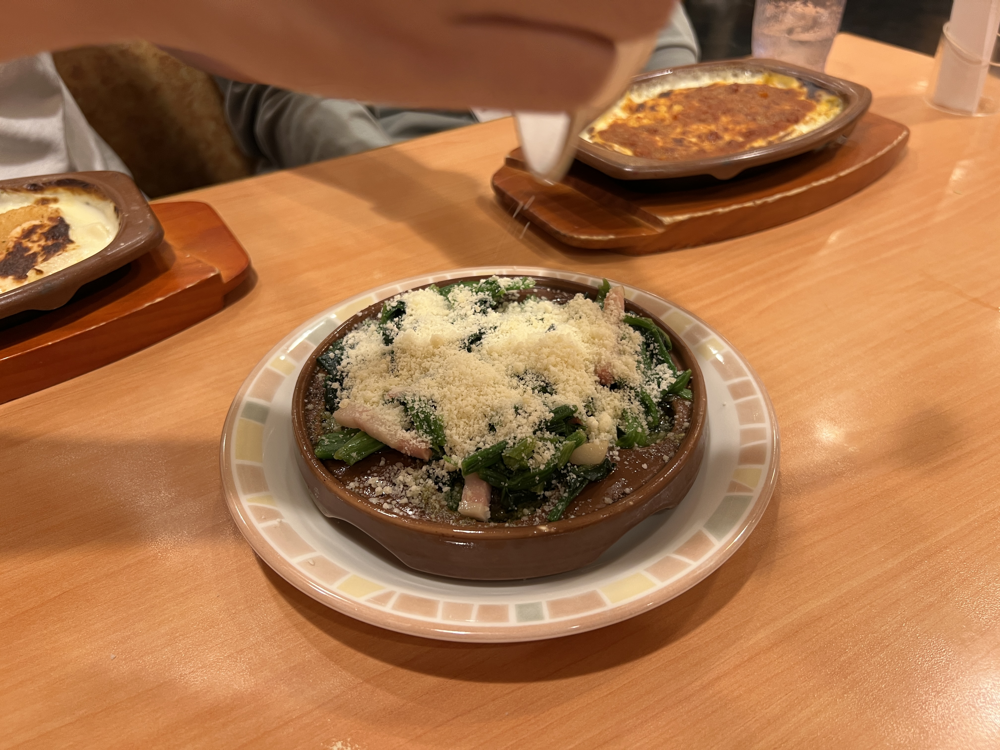
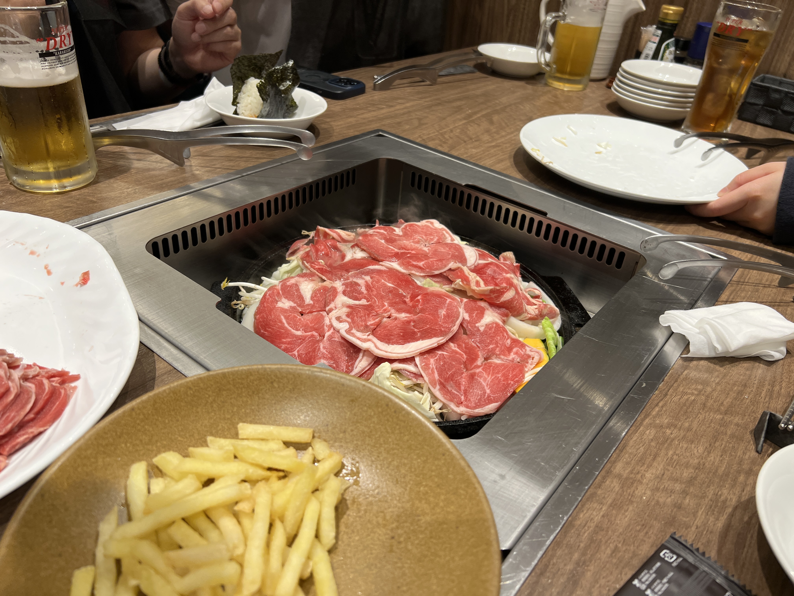

今回はフロントエンド・PHPカンファレンス北海道2026に学生支援で参加させていただいたので、そちらの参加記を書こうと思います。  

## ちょっとした自己紹介

今回はフロントエンド・PHPカンファレンス(以下、ふろぺち)運営の方にこの記事をご紹介いただくそうなので、一応...  

**公立はこだて未来大学**の学生です。普段は演習や個人開発でフロントエンドをメインに開発をしています。  
一番最初に触ったのがNext.jsということもあってずっとNextばっかり触ってますが、最近はAstroを触り始めるなど知見を広げようと思ったり...  
あとは、ちょっとバックエンドも触ってみたいなぁとうっすら思っていて、Laravelの公式ドキュメントを眺めるなどをしていました。  

## 参加したきっかけ

大学で[Mariners' Conference](https://mariconf.connpass.com/)という技術系のLTをするサークルに属していて、今は副部長もやっているのですがそちらのDiscordでふろぺちの運営をやられているOBの方が **学生支援あるよ！** と宣伝をしてくれたのがきっかけです。  
カンファレンスというもの自体参加した経験がなく、少し畏れ多いものでしたが**学生支援**に背中を押されて参加することにしました！  

<LinkCard url="https://note.com/kotomi1338/n/n5ef95d9f59c6" />

この**学生支援**がすごくて、参加費・懇親会費・交通費・宿泊費すべて負担してくれるのです！ちょうど予定も空いてましたし、行かない理由がないですね！！  

## 当日

https://x.com/onnenai_w57/status/2063066982807994591

ホテルに財布を忘れてカーシェアで取りに行くなど変なことをしながら...  

https://x.com/onnenai_w57/status/2063083183504228696

なんとか札幌コンベンションセンターに到着。  

### 印象に残ったセッション

<LinkCard url="https://fortee.jp/frontend-phpcon-do-2026/proposal/185a62f1-8eb5-4ab2-9d38-80e5315641ee" />

日本語を扱う上では特に気を付けたい内容ですね...  
特に、異体字セレクタのトピックに関してはとても興味深かったです！  

<LinkCard url="https://fortee.jp/frontend-phpcon-do-2026/proposal/70db0a0b-fbaf-4433-acbc-860f7f9509a0" />

フロントエンドを開発する者として、大変共感できるとともに勉強になる話でした！  
「説明が必要になった時点で負け」や「わかるでしょ？は呪い」など力強いキーワードが印象的でした！  

<LinkCard url="https://fortee.jp/frontend-phpcon-do-2026/proposal/3435cc2a-90b6-4f28-8394-1d0665001020" />

AIとUIの関係を3つに分類してそれぞれのメリットデメリットを分析した上で、第4のパターンを提唱されてましたね！  
AIにReactを書かせてそれをチャット内でレンダリングするという発想に圧倒されました。  

<LinkCard url="https://fortee.jp/frontend-phpcon-do-2026/proposal/2ed86c32-3691-44c2-95bf-f1dced63abb2" />

こちらはLTセッションでのトークですね。MIDIファイルをブラウザで再生したい！という熱い思いが伝わってきました！  
Claudeに耳があるかはおいておいて(笑)、Claudeもそこそこの品質のMIDIファイルが作れることも印象的でした。

### ランチマッチング

お昼どうしようかな～と考えてたら、なんと**ランチマッチング**なるものがあるらしい！  
その場で出会った初めましての人とグループを組んでランチに行きます。  

今回は集まった人たちとラソラ札幌のサイゼリヤに行きました！  

関東でお仕事をされている方や東海地方の方など、道外のグローバルな話を聞きながらサイゼリヤのアレンジメニューまで教えていただいて、とても楽しかったです！  

### 懇親会

懇親会はすすきののど真ん中にある羊ヶ亭さん！  
美味しいジンギスカンに舌鼓！！  

科技大の方や社会人の方々に大変良くしていただいて、楽しい懇親会になりました。
本当にありがとうございます😭

### さいごに
改めまして、カンファレンスを運営してくださった皆さん、学生支援に協力してくださった個人スポンサーの方々、イベントに関わられたすべての皆さんに感謝申し上げます。  

今回参加してみて、たくさんの新しい技術や知識に触れることができて、自分の開発モチベーションにも繋がりました。  
またフロントエンドとPHPのコラボという点では、フロントエンドがメインの私もPHPやバックエンドの話を聞く機会になり、大変知見が広がりました。  

ランチマッチングから懇親会に至るまで、たくさんの素晴らしい出会いに感謝したいと思います。  
今後も何らかの形でフロカンに関われたらいいなと思っています。  

ありがとうございました！  

https://open.spotify.com/intl-ja/track/6LScGTMqo6d2IZsznhSJHx