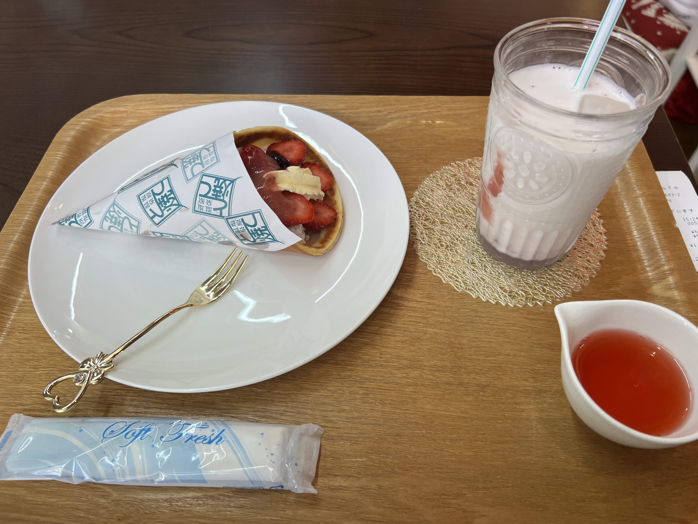
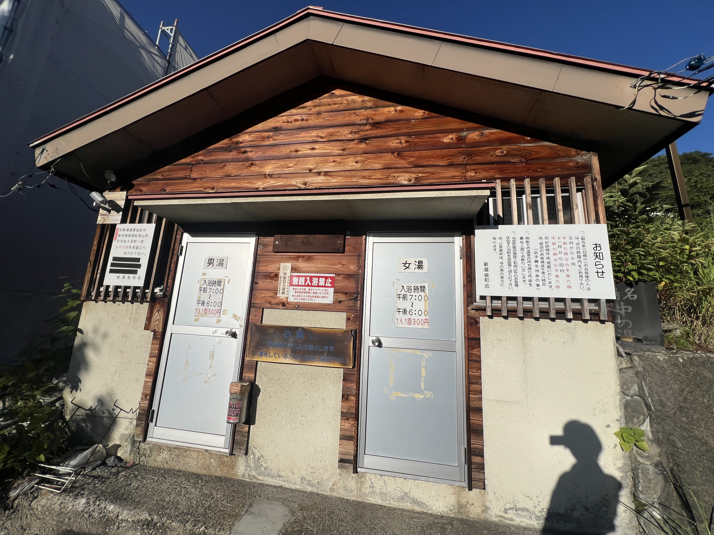
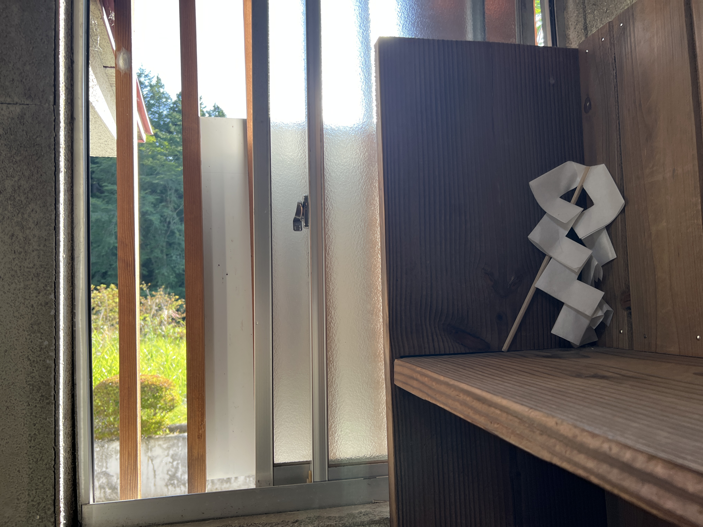

二十歳の誕生日、なんかとんでもないことしてぇなぁって思ってたら...

https://post.yourein.net/notes/aogteif0qq

という耳寄り情報が。

https://social.onnenai.cc/notes/aogt8fru2nzn02kd

ということで予約しました。渓雲閣、八弥ちゃんプラン。

## 塩原行くぞ！

おんねないさん誕生日が8/10なんですよ。運命だなぁ...  

ということで誕生日に合わせてお宿を取りました。
ネット予約は2人からになってたんですが、オタクに友達がいるわけなくメールして予約させてもらいました。  

https://social.onnenai.cc/notes/apq09ubw2nzn050y

那須塩原までは新幹線。  
はやぶさ→やまびこ→なすの と乗り換えが面倒だけどしゃーなし...  

https://social.onnenai.cc/notes/apqb3xpp2nzn052a

ということになりましたが、無事那須塩原の駅まで到着。  

https://social.onnenai.cc/notes/apqbz1bv2nzn052i

駅には那須と塩原のおんむすがお出迎え！初めまして！！  

https://x.com/onnenai_w57/status/2086687583430709265

タイムズを借りて塩原温泉まで向かうぞ！！！  

## 塩原温泉ヤバすぎ

まず初めに向かったのは塩原温泉で一番、というか温泉むすめ事業者で一番エグイ祭壇()を設けている「SUZUの森Cafe」  

https://social.onnenai.cc/notes/apqf3dbo2nzn052n

僕が到着したときには既に常連のぽかさんが3人いらっしゃって、いろいろ話を聞きながらとて焼きを食うなどした。  

普通に僕は八弥ちゃんコーナーに圧倒されて頭回ってなかったが...スイーツはめっちゃ美味かった！
いや、普通に考えてお洒落なカフェの一角が激ヤバ空間なのおかしすぎるやろ！(褒め言葉)  

https://x.com/onnenai_w57/status/2086701412889862256

16:00過ぎてそろそろお風呂にも入りたくなってきたので、本日のお宿に向かいます。  

## 好きな女性がいるお宿

到着しました渓雲閣！駐車場からスタッフさんがいて、靴も勝手にあげてくれる...とんでもないお宿に来てしまったぞ...

https://x.com/onnenai_w57/status/2086720017362776398

お部屋に入ったら... **八弥ﾁｬﾝ！！！**

静かなお部屋に... **八弥ﾁｬﾝ！！！**

僕と... **八弥ﾁｬﾝ！！！**

なんて素敵な空間なんだ...言葉はいらない...  

さて、ちょっと目線を気にしながら着替えてまずはお風呂に向かいます。  

https://social.onnenai.cc/notes/apqjhq9c2nzn053a

渓雲閣がある塩原温泉 新湯温泉は硫黄山がある自然湧出の温泉。そのため最盛期は公共浴場が3軒もあったとのこと。どれも協力金の300円を支払えば入れるものでした。  

しかし湯量減少の為、今では一つしか開いていないそうです。渓雲閣の宿泊者はタダで入れるらしい。  

お風呂の名前は**中の湯**。ぽつんと旅館街の中にある公衆トイレのような規模感の建物。  
中は男女ともに小さな脱衣所と大人が2人入るのがやっとの檜の湯船が一つ。  

一緒に居合わせた旅行者に熱いですか？と聞かれて軽く湯船に入り「43℃くらいですかね」って言ったらガチで水温計が43℃を指していたらしく、函館の人間の"強さ"を見せつけてしまった...  

泉質は事前調べの通り**酸性硫黄泉**で文句なし。太陽が傾いていたこともあり、なんとも幻想的な雰囲気でした。  

お部屋に帰って少し早い夕飯に。  

https://x.com/onnenai_w57/status/2086739182333157586

**なんと！美少女と！対面で！ご飯！！！**  
最高過ぎて意味わからん。なんだこの多幸感。

https://social.onnenai.cc/notes/apst127a2nzn05b9

裏話でもなんでもないんですけど、こういったことがありまして、電話してるときガチで恥ずかしかったです。  

## まさかの出会いと花火と

なんか誕生日に合わせてお宿を取ったのでイベント情報とかなにも調べてこなかったんですけど、花火大会の日だったらしくて  

https://social.onnenai.cc/notes/apqmuxc92nzn054l

せっかくなので行ってみることにしました。  

https://social.onnenai.cc/notes/apqn4zmp2nzn054p

温泉街はホコ天になっているので駐車場に車を停めて...

https://social.onnenai.cc/notes/apqnzl5n2nzn054t

花火まで時間があるので訪れたのは**カフェ&バー ライト**さん。  
眼鏡かけた珍しい八弥ちゃんがいるので寄ってみたかったところです！  

店内は結構にぎわっていて、偶然にも八弥ちゃんのパネルがすぐわきにある席しか空いてなかったのでそこに着席。一番人が多い時間でマスターも忙しそう...  

カウンターでお兄さんとおばちゃんが慣れた感じで喋っていたので勇気を出して声かけてみることに。  

「地元の方ですか？」「いえ、地元ではないですけど常連ですよ」  

そんななんてことない会話から始まって、今日泊っている宿の話とかしてたら...  
マスターが「もしかして誕生日の？」って聞くからもうビックリしちゃって！！  

https://social.onnenai.cc/notes/apqqjgkl2nzn0554

らしい。なんやねんマジで...おかげで話のネタになったからいいけど...  
そんな感じでバーのお客さんから二十歳を祝われていたらそろそろ花火の時間  

https://social.onnenai.cc/notes/apqpp2fk2nzn054x

バーの前の駐車場から花火がとってもよく見えて、感動しました。人混みが嫌いであまり花火とか見に行かなかったんですけど、塩原はゆったり見ることができて最高でした。  

その日は肌寒くって30分ずっとは見続けられなかったのでバーに戻って隣の方と話していると、なんとエンジニアの方らしい。僕もエンジニアリングかじってるので話が弾みました。  

それと、ドライブが趣味なようで愛車は**ロードスター**。僕も今日はmazda3を借りてきたのでドライブトークやマツダトークで盛り上がり...

https://x.com/onnenai_w57/status/2086781540684681300

最後にはごちそうまでしていただいちゃいました...ほんまにそこまでしていただいてありがとございます...
カフェ&バー ライトさんは結構いつでも営業してらっしゃるとのことなので、今度は近くのお宿に泊まってお酒飲みたいな♪  

お宿に戻ったらお布団がひかれていました。  

https://social.onnenai.cc/notes/apqrqicc2nzn055j

やるしかないよね...

https://social.onnenai.cc/notes/apqthrk92nzn055w

食前酒に用意されたいちごワインを車運転するからと取っておいてもらったので今飲みます。甘くていちごの芳醇な香りがして美味しい！アルコールの嫌な感じもなくてめちゃくちゃ気に入りました！

https://social.onnenai.cc/notes/apqxnua72nzn056j

そろそろ寝ようかと電気を消すと、なんか、ちょっと、ねぇ...  
てかコイツ太ももの写真撮りすぎだろ。エロガキがよ...  

## セレンディピティとはこのこと...？

https://social.onnenai.cc/notes/aprcgmvy2nzn057a

またキモいこと言ってますね。そろそろ職質されるんじゃないの。  

https://social.onnenai.cc/notes/aprd5uys2nzn057h

とまあ朝風呂に行って

https://social.onnenai.cc/notes/apre81m52nzn0585

朝ごはんの時間です。やっぱり部屋出しのご飯はぼっち旅行者にも優しくていいですね。

https://social.onnenai.cc/notes/aprfsnk52nzn058f

食べ終わって貸切露天風呂を覗いたら空いていたので行きました！
渓雲閣さんには宿泊者なら誰でも入れる貸切露天風呂があって、これがとっても良かった！  

宿の周りが本当に何もない秘湯って感じで、朝の冷たい風と熱めのお風呂。硫黄の香りを感じながら一人で入る露天風呂は、俗世を離れて心の底からゆったりできる素敵な時間でした。マジで良すぎて感動で泣きオタク。  

https://social.onnenai.cc/notes/aprg7zne2nzn058k

今日も予定があるので早めにチェックアウト。こればっかりはしょうがない...  
バイバイ八弥ちゃん、また来るね。  

https://x.com/onnenai_w57/status/2086972250595696959

チェックアウトして最初に向かったのは**塩原もの語り館**  
物産館兼観光案内所みていな感じかな？八弥ちゃんのグッズも結構あってつい手に取ってしまう...  

https://social.onnenai.cc/notes/aprhj4on2nzn058q

ろ、ロリコンじゃないから！！  

#### そして！昨日バーで出会ったエンジニアの方と待ち合わせをしてドライブに連れて行ってもらいました！！  
これ普通に意味わからん。

https://social.onnenai.cc/notes/aprmb2ch2nzn058y

"ND"ロードスターです失礼しました。  

乗せてもらったのはロードスターの中でも990sという車重990kgを達成した特別仕様車。lei04レーダー探知機が付いていて流石にオタク仕様で良すぎ。  

オープンカーなんて暑いし巻き込みすごいし不必要な装備だろと思ってたけど、乗ってみたら考えが180度変わるほど良かった。
やっぱりマツダはずっとオープンカー作ってるだけあって空力めちゃくちゃ考えられてて巻き込みが全くない。
それでもっていい感じに外の空気が入ってきて、その上全然声張らなくても会話できる静かさ。
心地よいエンジンサウンドと自然を全身で感じる爽快感。もうね、欲しくなっちゃったよ。マニュアルの操作もコクコク楽しそうで、本当に楽しく走るためのクルマなんだなと感じました。
ロードスターの良かったところを語りだすとキリがないのでこの辺にしておきますが、間違いなく人生に影響を与えたクルマになりました。  

長々と失礼しましたが、ロードスター良すぎ！！！って思っている中で、2時間ほど峠道をドライブしながらロードスターの話やエンジニアリングの話をしました。  

自分も最近大学でのチーム開発で開発体験とかプロセスの品質について考える機会が...という相談をしたりして、とっても為になるお話をしていただきました。  

https://x.com/onnenai_w57/status/2087917194781114692

実は結構その界隈では凄い人だったようで、この本の訳をしている方だそう...　お礼にといってはなんですが、せっかくなので買ってみました。結構自分の興味分野でもあるのでありがたく読ませていただきます。  

そのあとはいちごワインを求めて塩原を彷徨い...  

https://social.onnenai.cc/notes/aprn7jyy2nzn0594

タイムズを那須塩原駅前で返して今回の旅行は終了。  

https://social.onnenai.cc/notes/aps4if9p2nzn05ak

https://social.onnenai.cc/notes/aps4j8kl2nzn05al

無事ロードスターに脳を焼かれて、今頃カーセンサーを眺めているんじゃないっすかね。  
あとMT車乗たすぎてAT限定を猛烈に後悔しています。  

https://social.onnenai.cc/notes/aps6cpdd2nzn05at

自宅で買ったいちご酒を八弥ちゃんのアクスタを眺めながら飲むのが最近の楽しみになっています。  

## さいごに

https://social.onnenai.cc/notes/aps1vkk72nzn05a8

多分3月に豊富に連行されてなければこんなことしてなかったので、バケモンのオタクことYourein氏にはとても感謝しております。いつもありがとうございます。  
(そういえば豊富の旅行記書いてねぇな...というかバケモンの旅程すぎて書けないかも)  

皆さんも、特別な日は、好きな女性(二次元)に会いに行ってみるといいですよ。きっと素敵な何かが待っています。  

https://open.spotify.com/intl-ja/track/22OTUylWa5rGzLRU3mMPBn