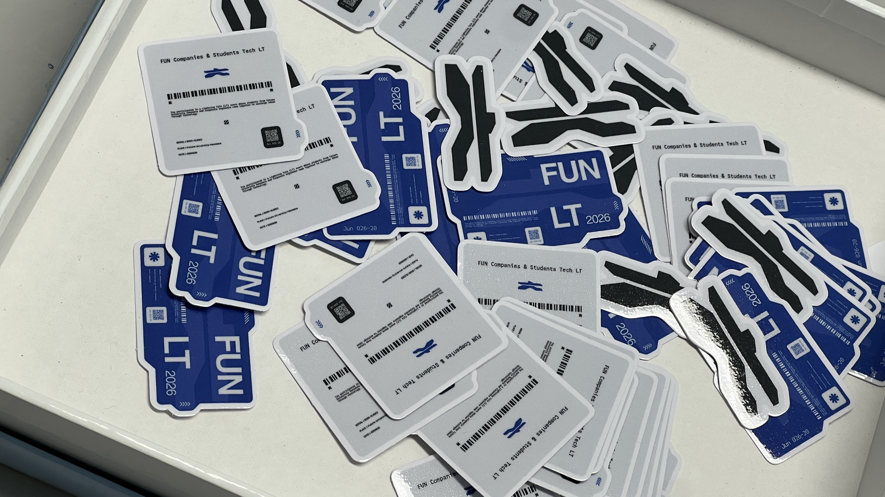
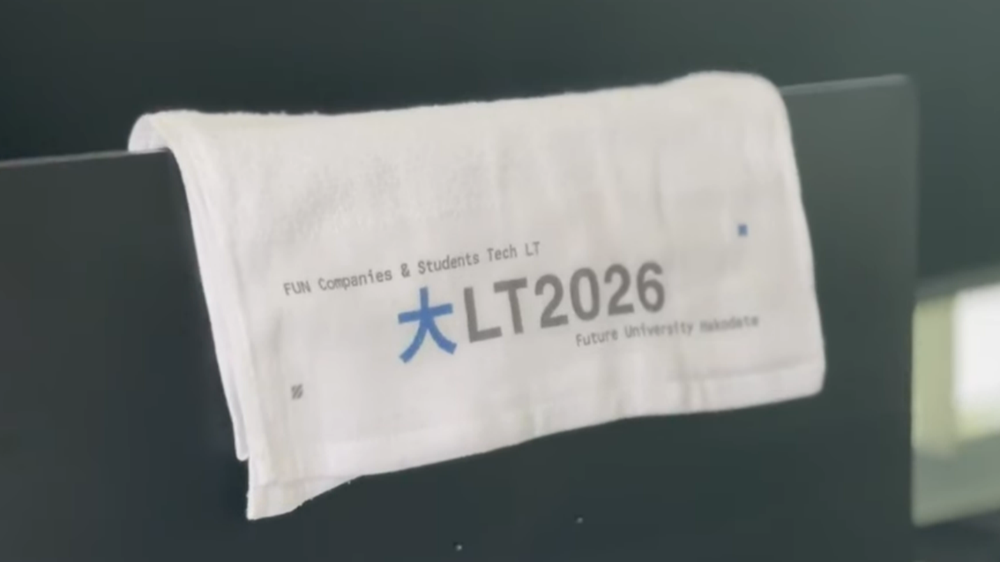
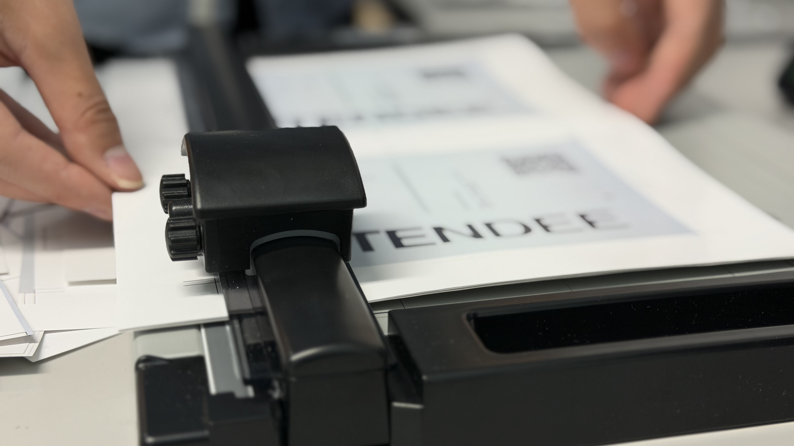
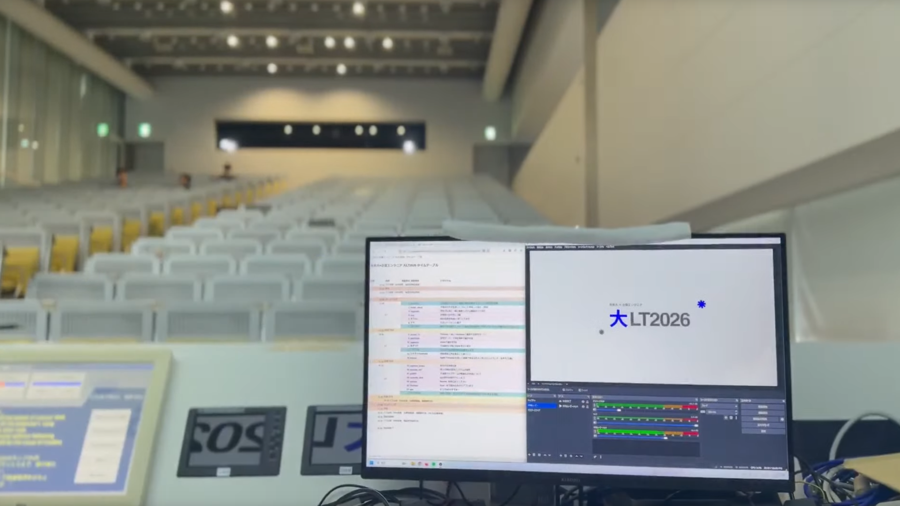

## はじめに

こんにちは、**おんねない**です。  

運営及び当日スタッフとして、6/20(土)に「はこだて未来大×企業エンジニア 大LT2026」を開催いたしました。  

当日及び企画や準備段階の様子を振り返りつつ、イベントの感想をまとめます。  

イベントのconnpassページはこちら↓  

<LinkCard url="https://fun.connpass.com/event/393227/" />

## 企画・準備
今回、ぺるきさん及びuiroさんにお誘いいただき、運営メンバーとして参加しました。  
issyさんやのるてさん、オリーブさんを含めた6名で企画・準備を進めてきました。  
私自身、このような技術系の大きなイベントの運営に参加するのは初めてで不安もありましたが、経験豊富なメンバーの方々がいらっしゃってとても心強かったです。  

さて、私が担当したのは主にスポンサー企業誘致とノベルティ制作です。  
### スポンサー企業誘致
大LTのような大規模イベントを開催するにあたりスポンサー企業の協力は欠かせません。  
運営メンバーの中で、コネクションがある企業さんや過去にスポンサーとして協力していただいた企業さんに声をかけて進めていきました。  
私も一部協力させていただいて、無事企業さんにスポンサーとして協力していただくことができました。  

イベント開催やノベルティ制作の費用、当日の企業ブースやLT登壇まで、スポンサー企業さんには大変お世話になりました。  

### ノベルティ制作
ノベルティ制作に関しては私が中心となって進めました。  

今まで参加したいくつかのイベントのノベルティを参考にしつつ、イベントのテーマや函館らしさを意識して制作しました。  

#### ステッカー

ステッカーはデザイナーの**オリーブ**さんにデザインをお願いしました！  
クールでテックイベントっぽいデザインになっており、とても気に入っています。  

#### 温泉タオル

もう一つ、とっておきのノベルティとして**オリジナル温泉タオル**を制作しました！  
函館にはたくさんの素晴らしい温泉があることから、イベントに参加した後はぜひ市内の温泉に行ってほしいという思いを込めて制作しました。  

## 当日の様子

当日の朝は名札の制作から始まりました。  

プリンタで印刷したオリジナルデザインの名札をカットして作っていきます。  
実はこの名札のデザインにもちょっとした工夫が！参加者の皆さんは裏面QRコードを読み込んでみてくださいね！  

## 懇親会

## さいごに

代表のuiroさんの記事  
<LinkCard url="https://uiro.dev/blogs/ltfes2026fun" />

デザイナーのオリーブさんの記事  
<LinkCard url="https://note.com/cool_briony7571/n/na2f1b8e5a910" />